# Data Mining

——文本分类：寻找24本书的相关性并将相似的聚类

## 1. 编写运算所需类和函数


```python
%matplotlib inline
import os
import re

import pandas as pd
import matplotlib.pyplot as plt
from wordcloud import WordCloud

import nltk
from nltk.corpus import words
from nltk.corpus import stopwords
from nltk.tokenize import sent_tokenize
from nltk.tokenize import word_tokenize
from nltk.probability import FreqDist
from nltk.stem.snowball import SnowballStemmer

from sklearn.feature_extraction.text import TfidfVectorizer
from sklearn.metrics.pairwise import cosine_similarity
from sklearn.cluster import KMeans
from sklearn.manifold import MDS

from scipy.cluster.hierarchy import ward, dendrogram
```


```python
# filter stopwords
stopwords = stopwords.words('english')
en_words = set(words.words())
stemmer = SnowballStemmer('english')
```


```python
# 按照文件读取顺序排列的书籍名称
titles = ['THE HISTORY OF THE DECLINE AND FALL OF THE ROMAN EMPIRE. VOL. VI',
          'THE HISTORIES CAIUS COBNELIUS TACITUS',
          'THE WORK OF JOSEPH US, THE JEWISH WAR. VOL. IV',
          'THE HISTORY OF THE DECLINE AND FALL OF THE ROMAN EMPIRE. VOL, I',
          'THE HISTORY OF TACITUS. BOOK I. VOL. V',
          'THE FIRST AND THIRTY-THIRD BOOKS OF PLINY\'S NATURAL HISTORY',
          'THE HISTORY OF THE ROMAN EMPIRE. VOL. V',
          'THE HISTORY OF THE DECLINE AND FALL OF THE ROMAN EMPIRE. VOL. II',
          'THE HISTORY OF THE PELOPONNESIAN WAR. VOL. II',
          'TITUS LIVIUS\' ROMAN',
          'THE HISTORY OF ROME,  BY TITUS LIVIUS. VOL. I',
          'THE HISTORY OF THE DECLINE AND FALL OF THE ROMAN EMPIRE. VOL. IV',
          'DICTIONARY GREEK AND ROMAN GEOGRAPHY. VOL. II',
          'THE LEARNED AND AUTHENTIC JEWISH HISTORIAN AND CELEBRATED WARRIOR. VOL. III',
          'LIVY. VOL. III',
          'LIVY. VOL. V',
          'THE HISTORICAL ANNALS OF CORNELIUS TACITUS. VOL. I',
          'THE HISTORY OF THE PELOPONNESIAN WAR. VOL. I',
          'THE LEARNED AND AUTHENTIC JEWISH HISTORIAN,  AND CELEBRATED WARRIOR. VOL. IV',
          'THE DESCRIPTION OF GREECE',
          'THE HISTORY OF THE DECLINE AND FALL OF THE ROMAN EMPIRE. VOL. III',
          'TTHE HISTORY OF ROME. VOL. III',
          'HE HISTORY OF TACITUS. BOOK I. VOL. IV',
          'THE FLAVIUS JOSEPHU',
          ]
```


```python
def tokenize_and_filter_punc(raw_text):
    tokens = nltk.wordpunct_tokenize(raw_text)
    text = nltk.Text(tokens)
    words = [w.lower() for w in text if w.isalpha()]

    return words
```


```python
class BookObject(object):
    """
    每一本书籍建立一个类的对象
    """
    def __init__(self, title, contents, raw_texts=''):
        self.__title = title
        self.__contents = contents
        self.__raw_texts = raw_texts

    @property
    def title(self):
        return self.__title

    @property
    def raw_texts(self):
        return self.__raw_texts

    @property
    def contents(self):
        return self.__contents.keys()
```


```python
class TextClassification(object):
    """
    添加方法：
    添加一本书
    加载原始文本
    特征工程：计算文本单词数量，统计高频名词
    tf-idf方法
    k-means方法
    hierachical方法
    """
    def __init__(self):
        self.__books = []
        self.__no_of_features = 0
        self.__total_vocabularies = []
        self.__tf_idf_matrix = None
        self.__dist_matrix = None

    def add_a_book(self, book):
        self.__books.append(book)

    # 特征工程
    # 打印单词数量
    def print_word_count(self):
        words_count = {}
        for book in self.__books:
            text_arr = book.raw_texts.strip().split()
            count = 0
            for w in text_arr:
                if len(w) > 0:
                    count += 1

            words_count[book.title] = count

        print('The word counts of each book is:\n')
        for key, value in words_count.items():
            print(key, ':', value)

    # 打印tokenize之后的单词数量
    def print_word_count_after_tokenization(self):
        words_count = {}
        for book in self.__books:
            text = book.raw_texts.strip()
            res = tokenize_and_filter_punc(text)
            words_count[book.title] = len(res)

        print('The word counts of each book after tokrnize is:\n')
        for key, value in words_count.items():
            print(key, ':', value)
    
    # 输出每本书使用频率前20名的单词
    def highfreq_noun(self):
        print('High frequency noun in each book:\n')
        for book in self.__books:
            text = book.raw_texts
            tokens = tokenize_and_filter_punc(text)
            freq_dist = FreqDist(tokens)
            tagged = nltk.pos_tag(tokens)
            minfo = dict(freq_dist)
            info = list(set([k.lower() for k,v in tagged if v == 'NN']))
            kinfo = [(k,minfo.get(k)) for k in info]
            kinfo.sort(key=lambda k:k[1],reverse=True)
            kinfo = [w for w in kinfo if len(w[0]) > 3]
            output1 = ",".join([m[0] for m in kinfo[:20]])
            print('《',book.title[:-4], '》:\n', output1)
            output2 = " ".join([m[0] for m in kinfo[:20]])
            this_wordcloud = WordCloud().generate(output2)
            plt.imshow(this_wordcloud)
            plt.axis('off')
            plt.show()
            
            

    # TF-IDF计算词频
    def tf_idf(self):
        tfidf_matrix = None
        tfidf_vectorizer = TfidfVectorizer(max_df=0.9,
                                           max_features=200000, 
                                           min_df=0.01, 
                                           stop_words='english',
                                           use_idf=True,  
                                           tokenizer=tokenize_and_filter_punc, 
                                           ngram_range=(1, 1))
        books = []
        for book in self.__books:
            books.append(book.raw_texts)

        tfidf_matrix = tfidf_vectorizer.fit_transform(books)

        self.__tf_idf_matrix = tfidf_matrix
        print(self.__tf_idf_matrix.shape)

        self.__dist_matrix = 1 - cosine_similarity(self.__tf_idf_matrix)

    # K-means算法
    def k_mean_clustering(self, n_clusters=5):
        num_clusters = n_clusters

        km = KMeans(n_clusters=num_clusters)
        km.fit(self.__tf_idf_matrix)
        clusters = km.labels_.tolist()
#         print(clusters)

        synopses = []
        for book in self.__books:
            synopses.append(book.raw_texts)

        books = {'title': titles, 'synopsis': synopses, 'cluster': clusters}

        frame = pd.DataFrame(books, index = [clusters] , columns = ['title', 'cluster'])
        print(frame['cluster'].value_counts())
        #grouped = frame['title'].groupby(frame['cluster']) #groupby cluster for aggregation purposes

        #print grouped.mean() #average rank (1 to 100) per cluster

        # convert two components as we're plotting points in a two-dimensional plane
        # "precomputed" because we provide a distance matrix
        # we will also specify `random_state` so the plot is reproducible.
        mds = MDS(n_components=2, dissimilarity="precomputed", random_state=1)

        pos = mds.fit_transform(self.__dist_matrix)  # shape (n_components, n_samples)
        xs, ys = pos[:, 0], pos[:, 1]
#         print(xs)
#         print(ys)

        #set up colors per clusters using a dict
        cluster_colors = {0: '#1b9e77', 1: '#d95f02', 2: '#7570b3', 3: '#e7298a', 4: '#66a61e'}

        #set up cluster names using a dict
        cluster_names = {0: 'Group 1',
                         1: 'Group 2',
                         2: 'Group 3',
                         3: 'Group 4',
                         4: 'Group 5'}

        #create data frame that has the result of the MDS plus the cluster numbers and titles
        df = pd.DataFrame(dict(x=xs, y=ys, label=clusters, title=titles))

        #group by cluster
        groups = df.groupby('label')

        # set up plot
        fig, ax = plt.subplots(figsize=(20, 14)) # set size
        ax.margins(0.05)  # Optional, just adds 5% padding to the autoscaling

        #iterate through groups to layer the plot
        #note that I use the cluster_name and cluster_color dicts with the 'name' lookup to return the appropriate color/label
        for name, group in groups:
            ax.plot(group.x, group.y, marker='o', linestyle='', ms=12,
                    label=cluster_names[name], color=cluster_colors[name],
                    mec='none')
            ax.set_aspect('auto')
            ax.tick_params(\
                axis= 'x',          # changes apply to the x-axis
                which='both',      # both major and minor ticks are affected
                bottom='off',      # ticks along the bottom edge are off
                top='off',         # ticks along the top edge are off
                labelbottom='off')
            ax.tick_params(\
                axis= 'y',         # changes apply to the y-axis
                which='both',      # both major and minor ticks are affected
                left='off',      # ticks along the bottom edge are off
                top='off',         # ticks along the top edge are off
                labelleft='off')

        ax.legend(numpoints=1)  #show legend with only 1 point

        #add label in x,y position with the label as the film title
        for i in range(len(df)):
            ax.text(df.ix[i]['x'], df.ix[i]['y'], df.ix[i]['title'], size=8)

        plt.show() #show the plot

    # 层级聚类
    def hierachical_clustering(self):
        linkage_matrix = ward(self.__dist_matrix) #define the linkage_matrix using ward clustering pre-computed distances

        fig, ax = plt.subplots(figsize=(15, 9)) # set size
        ax = dendrogram(linkage_matrix, orientation="right", labels=titles);

        plt.tick_params(\
            axis= 'x',          # changes apply to the x-axis
            which='both',      # both major and minor ticks are affected
            bottom='off',      # ticks along the bottom edge are off
            top='off',         # ticks along the top edge are off
            labelbottom='off')

        fig.set_tight_layout(True) #show plot with tight layout
        plt.show()

    # 加载原始文本并运行
    def load_raw_text(self):
        rootdir = '/Users/suhang/Documents/GitHub/COMP6237-Data-Mining/cw2-understanding-data/raw_text'
        files = os.listdir(rootdir)
        for file in files:
            if file != '.DS_Store':
                file_path = os.path.join(rootdir, file)
                if os.path.isfile(file_path):
                    with open(file_path) as f:
                        raw_texts = f.read()

                        book = BookObject(file, {}, raw_texts=raw_texts)
                        self.add_a_book(book)
```

## 2. 创建对象并调用函数，输出结果


```python
test = TextClassification()
```


```python
test.load_raw_text()
```

### 2.1 初步探索

#### 2.1.1 统计每本书使用率前20名的名词


```python
test.highfreq_noun()
```

    High frequency noun in each book:
    
    《 THE HISTORY OF THE DECLINE AND FALL OF THE ROMAN EMPIRE. VOL. VI 》:
     torn,roman,empire,hundred,thousand,mahomet,chap,name,emperor,hist,city,greeks,life,arabs,religion,death,church,caliph,reign,rome


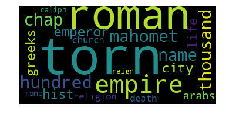


    《 THE HISTORIES CAIUS COBNELIUS TACITUS 》:
     note,quam,quod,vitellius,tacitus,subj,galba,inter,neque,otho,quae,apud,essay,word,hist,sense,militum,exercitus,ejus,suet


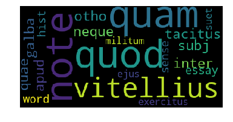


    《 THE WORK OF JOSEPH US, THE JEWISH WAR. VOL. IV 》:
     upon,jews,city,very,josephus,while,temple,before,time,king,place,wall,titus,come,jerusalem,vespasian,country,together,away,army


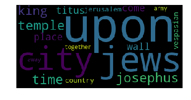


    《 THE HISTORY OF THE DECLINE AND FALL OF THE ROMAN EMPIRE. VOL, I 》:
     roman,empire,emperor,rome,hist,senate,death,decline,fall,public,well,power,time,life,general,august,ancient,army,reign,part


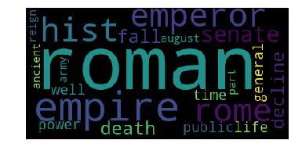


    《 THE HISTORY OF TACITUS. BOOK I. VOL. V 》:
     book,otho,vitellius,history,time,tacitus,galba,army,section,rome,nero,legion,emperor,public,city,whole,vespasian,enemy,camp,prince


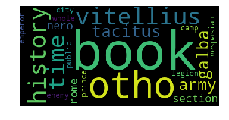


    《 THE FIRST AND THIRTY-THIRD BOOKS OF PLINY'S NATURAL HISTORY 》:
     gold,silver,kind,time,very,copper,account,weight,order,lead,while,substance,word,note,name,book,part,minium,term,water


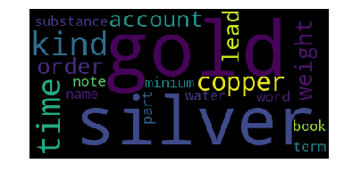


    《 THE HISTORY OF THE ROMAN EMPIRE. VOL. V 》:
     roman,chap,empire,justinian,thousand,emperor,hundred,first,fall,decline,belisarius,rome,italy,king,name,death,city,reign,general,public


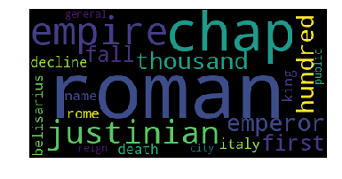


    《 THE HISTORY OF THE DECLINE AND FALL OF THE ROMAN EMPIRE. VOL. II 》:
     julian,roman,empire,chap,emperor,decline,fall,public,death,constantine,constantius,troops,theodosius,army,city,general,east,military,reign,imperial


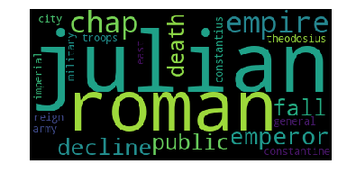


    《 THE HISTORY OF THE PELOPONNESIAN WAR. VOL. II 》:
     upon,time,whole,enemy,though,present,fleet,farther,therefore,city,before,hundred,state,sicily,make,force,land,athenian,army,sent


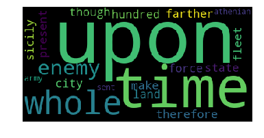


    《 TITUS LIVIUS' ROMAN 》:
     have,roman,chap,city,time,upon,rome,enemy,senate,consuls,army,before,titus,history,consul,book,camp,country,livius,volsci


    《 THE HISTORY OF ROME,  BY TITUS LIVIUS. VOL, I 》:
     have,city,time,fuch,enemy,rome,fhould,againft,fenate,thefe,confuls,thofe,fame,roman,firft,conful,mould,book,camp,year


    《 THE HISTORY OF THE DECLINE AND FALL OF THE ROMAN EMPIRE. VOL. IV 》:
     roman,chap,empire,emperor,fall,justinian,decline,first,thousand,belisarius,rome,italy,reign,constantinople,city,death,king,name,palace,general


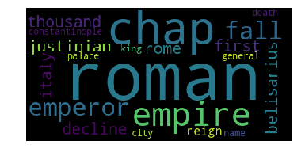


    《 DICTIONARY GREEK AND ROMAN GEOGRAPHY. VOL. II 》:
     name,town,city,ancient,place,river,time,part,strab,about,roman,coast,temple,ptol,though,first,pliny,country,plin,site


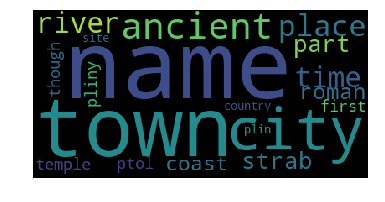


    《 THE LEARNED AND AUTHENTIC JEWISH HISTORIAN AND CELEBRATED WARRIOR. VOL. III 》:
     upon,jews,have,king,herod,about,sent,city,very,before,time,while,come,chap,caesar,agrippa,country,thou,account,together


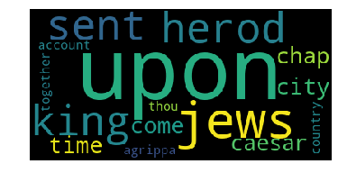


    《 LIVY. VOL. III 》:
     have,enemy,rome,consul,time,roman,army,made,consuls,camp,book,senate,while,history,troops,city,either,battle,thousand,sent


    《 LIVY. VOL. V 》:
     time,rome,enemy,city,roman,scipio,king,sent,senate,army,consul,while,book,thousand,history,troops,camp,general,hannibal,livy


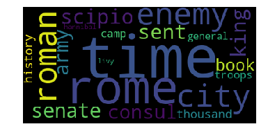


    《 THE HISTORICAL ANNALS OF CORNELIUS TACITUS. VOL. I 》:
     tiberius,time,germanicus,senate,rome,augustus,roman,prince,public,army,tacitus,piso,emperor,drusus,general,country,nothing,before,name,father


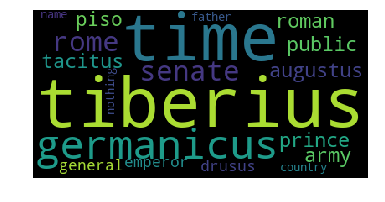


    《 THE HISTORY OF THE PELOPONNESIAN WAR. VOL. I 》:
     upon,such,time,city,hath,very,year,though,over,whole,athenian,public,present,greece,peloponnesian,power,place,part,thucydides,state


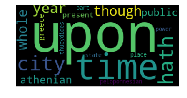


    《 THE LEARNED AND AUTHENTIC JEWISH HISTORIAN,  AND CELEBRATED WARRIOR. VOL. IV 》:
     king,jews,upon,herod,about,very,city,sent,temple,chap,time,country,army,come,jerusalem,while,book,away,hyrcanus,account


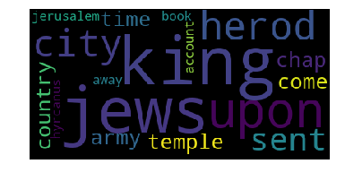


    《 THE DESCRIPTION OF GREECE 》:
     city,statue,page,place,temple,apollo,homer,river,jupiter,time,account,daughter,part,olympic,therefore,fame,hence,greece,picture,statuary


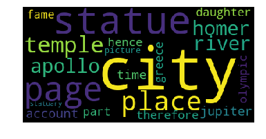


    《 THE HISTORY OF THE DECLINE AND FALL OF THE ROMAN EMPIRE. VOL. III 》:
     torn,roman,first,hundred,thousand,empire,emperor,justinian,name,city,rome,death,hist,constantinople,mahomet,reign,life,fall,general,italy


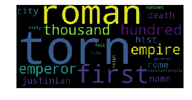


    《 THE HISTORY OF ROME. VOL. III 》:
     roman,even,sulla,rome,senate,time,state,such,army,king,government,italy,very,gracchus,book,general,chap,before,italian,gaius


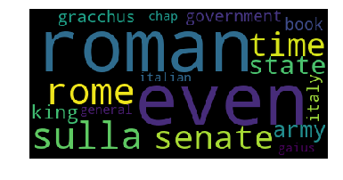


    《 THE HISTORY OF TACITUS. BOOK I. VOL. IV 》:
     nero,book,life,time,rome,emperor,death,daughter,tacitus,wife,public,roman,table,augustus,prince,claudius,section,suet,galba,city


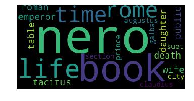


    《 THE FLAVIUS JOSEPHU 》:
     king,upon,jews,about,very,city,time,before,sent,over,come,because,josephus,temple,army,david,country,place,thou,while


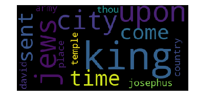


#### 2.1.2 输出切分词前每本书的单词数量统计结果


```python
test.print_word_count()
```

    The word counts of each book is:
    
    THE HISTORY OF THE DECLINE AND FALL OF THE ROMAN EMPIRE. VOL. VI.txt : 213422
    THE HISTORIES CAIUS COBNELIUS TACITUS.txt : 169627
    THE WORK OF JOSEPH US, THE JEWISH WAR. VOL. IV.txt : 233950
    THE HISTORY OF THE DECLINE AND FALL OF THE ROMAN EMPIRE. VOL, I.txt : 272089
    THE HISTORY OF TACITUS. BOOK I. VOL. V.txt : 74210
    THE FIRST AND THIRTY-THIRD BOOKS OF PLINY'S NATURAL HISTORY.txt : 30706
    THE HISTORY OF THE ROMAN EMPIRE. VOL. V.txt : 205502
    THE HISTORY OF THE DECLINE AND FALL OF THE ROMAN EMPIRE. VOL. II.txt : 166971
    THE HISTORY OF THE PELOPONNESIAN WAR. VOL. II.txt : 136976
    TITUS LIVIUS' ROMAN.txt : 175865
    THE HISTORY OF ROME,  BY TITUS LIVIUS. VOL, I.txt : 192044
    THE HISTORY OF THE DECLINE AND FALL OF THE ROMAN EMPIRE. VOL. IV.txt : 175260
    DICTIONARY GREEK AND ROMAN GEOGRAPHY. VOL. II.txt : 1659053
    THE LEARNED AND AUTHENTIC JEWISH HISTORIAN AND CELEBRATED WARRIOR. VOL. III.txt : 230261
    LIVY. VOL. III.txt : 115565
    LIVY. VOL. V.txt : 148879
    THE HISTORICAL ANNALS OF CORNELIUS TACITUS. VOL. I.txt : 74463
    THE HISTORY OF THE PELOPONNESIAN WAR. VOL. I.txt : 188864
    THE LEARNED AND AUTHENTIC JEWISH HISTORIAN,  AND CELEBRATED WARRIOR. VOL. IV.txt : 220162
    THE DESCRIPTION OF GREECE.txt : 144341
    THE HISTORY OF THE DECLINE AND FALL OF THE ROMAN EMPIRE. VOL. III.txt : 398707
    THE HISTORY OF ROME. VOL. III.txt : 204463
    THE HISTORY OF TACITUS. BOOK I. VOL. IV.txt : 78380
    THE FLAVIUS JOSEPHU.txt : 503619


#### 2.1.3 输出切分词后每本书的单词数量统计结果


```python
test.print_word_count_after_tokenization()
```

    The word counts of each book after tokrnize is:
    
    THE HISTORY OF THE DECLINE AND FALL OF THE ROMAN EMPIRE. VOL. VI.txt : 209590
    THE HISTORIES CAIUS COBNELIUS TACITUS.txt : 156262
    THE WORK OF JOSEPH US, THE JEWISH WAR. VOL. IV.txt : 228474
    THE HISTORY OF THE DECLINE AND FALL OF THE ROMAN EMPIRE. VOL, I.txt : 264682
    THE HISTORY OF TACITUS. BOOK I. VOL. V.txt : 72599
    THE FIRST AND THIRTY-THIRD BOOKS OF PLINY'S NATURAL HISTORY.txt : 29786
    THE HISTORY OF THE ROMAN EMPIRE. VOL. V.txt : 200783
    THE HISTORY OF THE DECLINE AND FALL OF THE ROMAN EMPIRE. VOL. II.txt : 164368
    THE HISTORY OF THE PELOPONNESIAN WAR. VOL. II.txt : 134429
    TITUS LIVIUS' ROMAN.txt : 174997
    THE HISTORY OF ROME,  BY TITUS LIVIUS. VOL, I.txt : 191334
    THE HISTORY OF THE DECLINE AND FALL OF THE ROMAN EMPIRE. VOL. IV.txt : 172728
    DICTIONARY GREEK AND ROMAN GEOGRAPHY. VOL. II.txt : 1603581
    THE LEARNED AND AUTHENTIC JEWISH HISTORIAN AND CELEBRATED WARRIOR. VOL. III.txt : 225245
    LIVY. VOL. III.txt : 114300
    LIVY. VOL. V.txt : 148669
    THE HISTORICAL ANNALS OF CORNELIUS TACITUS. VOL. I.txt : 73046
    THE HISTORY OF THE PELOPONNESIAN WAR. VOL. I.txt : 183434
    THE LEARNED AND AUTHENTIC JEWISH HISTORIAN,  AND CELEBRATED WARRIOR. VOL. IV.txt : 219372
    THE DESCRIPTION OF GREECE.txt : 137879
    THE HISTORY OF THE DECLINE AND FALL OF THE ROMAN EMPIRE. VOL. III.txt : 392485
    THE HISTORY OF ROME. VOL. III.txt : 203292
    THE HISTORY OF TACITUS. BOOK I. VOL. IV.txt : 75982
    THE FLAVIUS JOSEPHU.txt : 501711


#### 2.2 文本向量化


```python
#TF-IDF
test.tf_idf()
```

    (24, 200000)


### 3.根据用词相似度使用不同算法进行文本分类

#### 3.1 使用K-means算法进行分类


```python
# K-means 聚类
test.k_mean_clustering()
```

    0    8
    2    5
    3    4
    1    4
    4    3
    Name: cluster, dtype: int64


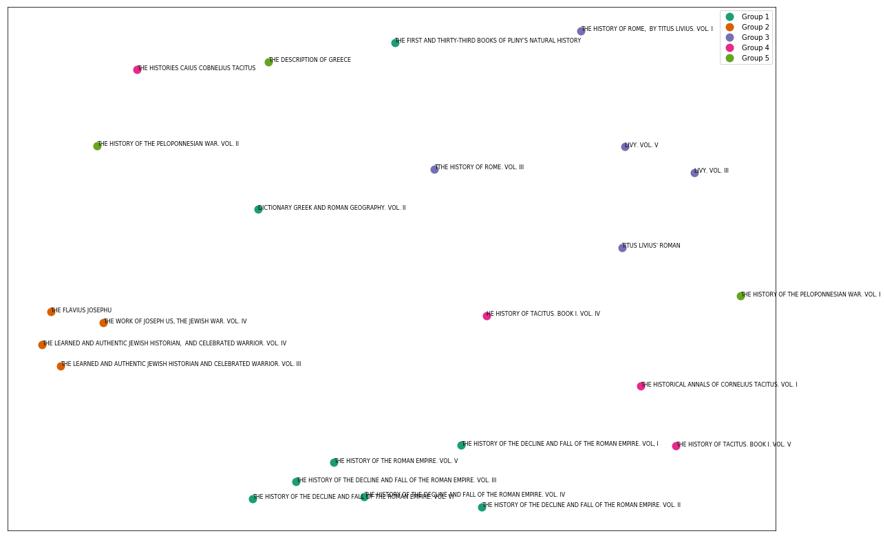


### Classification results

#### K-means Result:


|1. Group 1:|
|----|
    |- **THE FIRST AND THIRTY-THIRD BOOKS OF PLINY'S NATURAL HISTORY**; |
    |- DICTIONARY GREEK AND ROMAN GEOGRAPHY. VOL. II; |
    |- **THE HISTORY OF THE DECLINE AND FALL OF THE ROMAN EMPIRE. VOL. VI**; |
    |- THE HISTORY OF THE DECLINE AND FALL OF THE ROMAN EMPIRE. VOL. I; |
    |- **THE HISTORY OF THE ROMAN EMPIRE. VOL. V**; |
    |- THE HISTORY OF THE DECLINE AND FALL OF THE ROMAN EMPIRE. VOL. II; |
    |- **THE HISTORY OF THE DECLINE AND FALL OF THE ROMAN EMPIRE. VOL. IV**; |
    |- THE HISTORY OF THE DECLINE AND FALL OF THE ROMAN EMPIRE. VOL. III|
第一组为《罗马帝国衰亡史》的书籍。

但是，
THE FIRST AND THIRTY-THIRD BOOKS OF PLINY'S NATURAL HISTORY：译为《博物志》，古罗马学者普林尼所著书籍，被称为西方古代百科全书。

DICTIONARY GREEK AND ROMAN GEOGRAPHY. VOL. II：《希腊罗马古迹辞典》

这两本书分类不够理想。
    
|2. Group 2:|
|---|
    |- **THE FLAVIUS JOSEPHU**;| 
    |- THE WORK OF JOSEPH US, THE JEWISH WAR. VOL. IV; |
    |- **THE LEARNED AND AUTHENTIC JEWISH HISTORIAN AND CELEBRATED WARRIOR. VOL. III**; |
    |- THE LEARNED AND AUTHENTIC JEWISH HISTORIAN,AND CELEBRATED WARRIOR. VOL. IV;|
第二组结果比较好，均为与犹太历史文化相关书籍。

|3. Group 3:|
|----|
    |- **THE HISTORY OF ROME,BY TITUS LIVIUS. VOL. I**; |
    |- LIVY. VOL. III;| 
    |- **LIVY. VOL. V**; |
    |- THE HISTORY OF ROME. VOL. III*; **TITUS LIVIUS' ROMAN;|
第三组分类依据中比较突出的关键词为**Titus Livius**, 古罗马历史学家。
    
|4. Group 4:|
|----|
    |- **THE HISTORY OF TACITUS. BOOK I. VOL. IV**; |
    |- THE HISTORICAL ANNALS OF CORNELIUS TACITUS. VOL. I; |
    |- **THE HISTORY OF TACITUS. BOOK I. VOL. V**; |
    |- THE HISTORIES CAIUS COBNELIUS TACITUS|
第四组分类关键词**TACITUS**,塔西佗，古罗马历史学家。
    
|5. Group 5:|
|----|
    |- THE DESCRIPTION OF GREECE**; |
    |- THE HISTORY OF THE PELOPONNESIAN WAR. VOL. II;|
THE PELOPONNESIAN WAR：伯罗奔尼撒战争，雅典和斯巴达之间的战争。

因此第五组为与古希腊相关的书籍。

#### 3.2 使用层级聚类算法进行分类


```python
# 层级聚类
test.hierachical_clustering()
```

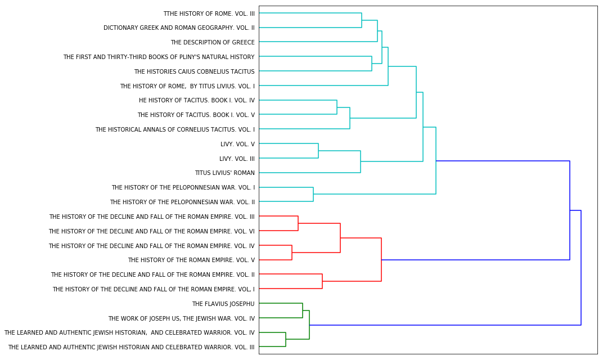


#### Hierachical Clustering Results:
|1. Group 1:|
|----|
    |- THE HISTORY OF ROME. VOL. III;|
    |- DICTIONARY GREEK AND ROMAN GEOGRAPHY. VOL. II;|
    |- THE DESCRIPTION OF GREECE;|
    |- THE FIRST AND THIRTY-THIRD BOOKS OF PLINY'S NATURAL HISTORY;|
    |- THE HISTORIES CAIUS COBNELIUS TACITUS;|
    |- THE HISTORY OF ROME, BY TITUS LIVIUS. VOL. I;|
    |- THE HISTORY OF TACITUS. BOOK I. VOL. IV;|
    |- THE HISTORY OF TACTIUS. BOOK I. VOL. V;|
    |- THE HISTORICAL ANNALS OF CORNELIUS TACTITUS. VOL. I;|
    |- LIVY. VOL. V;|
    |- LIVY. VOL. III;|
    |- TITUS LIVIUS' ROMAN;|
    |- THE HISTORY OF THE PELOPONNESIAN WAR. VOL. I;|
    |- THE HISTORY OF THE PELOPONNESIAN WAR. VOL. II;|

|2. Group 2:|
|----|
    |- THE HISTORY OF THE DECLINE AND FALL OF THE ROMAN EMPIRE. VOL. I;|
    |- THE HISTORY OF THE DECLINE AND FALL OF THE ROMAN EMPIRE. VOL. II;|
    |- THE HISTORY OF THE DECLINE AND FALL OF THE ROMAN EMPIRE. VOL. III;|
    |- THE HISTORY OF THE DECLINE AND FALL OF THE ROMAN EMPIRE. VOL. IV;|
    |- THE HISTORY OF THE ROMAN EMPIRE. VOL. V;|
    |- THE HISTORY OF THE DECLINE AND FALL OF THE ROMAN EMPIRE. VOL. VI;|

|3. Group 3:|
|----|
    |- THE FLAVIUS JOSEPHU;|
    |- THE WORK OF JOSEPH US, THE JEWISH WAR. VOL. IV;|
    |- THE LEARNED AND AUTHENTIC JEWISH HISTORIAN, AND CELEBRATED WARRIOR. VOL. III;|
    |- THE LEARNED AND AUTHENTIC JEWISH HISTORIAN, AND CELEBRATED WARRIOR. VOL. IV;|

### 4. Brief conclusion：

虽然K-means可以更详细的划分类别，但也容易出现误差，可以说层级聚类的分类结果比5个聚类的k-means结果要稍好。

在层级聚类中：
- 第一类都是关于古希腊古罗马历史文化的书籍
- 第二类是《罗马帝国衰亡史》的1-6卷
- 第三类均为关于犹太文化历史信息的书籍
